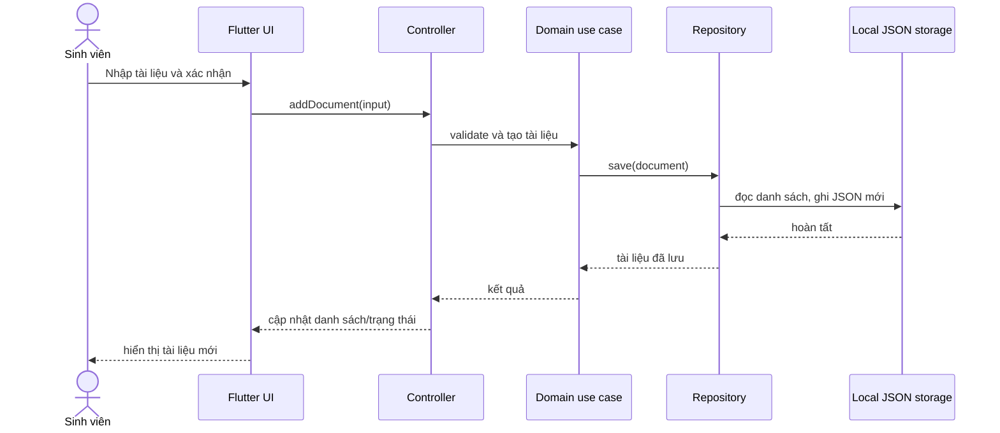

# Kiến trúc ứng dụng quản lý tài liệu học tập

## 1. Mục tiêu và phạm vi

Ứng dụng Cashew Study Library giúp sinh viên lưu và quản lý bài giảng, bài tập và tài liệu tham khảo. Phiên bản đầu tập trung vào CRUD, tìm kiếm theo tiêu đề/môn học và lọc theo loại tài liệu. Dữ liệu được lưu cục bộ trên thiết bị; đồng bộ đám mây, đăng nhập, đính kèm tệp thật và chia sẻ chưa thuộc phạm vi.

## 2. Yêu cầu chức năng

| Mã | Chức năng | Kết quả mong đợi |
| --- | --- | --- |
| FR-01 | Xem danh sách tài liệu | Hiển thị tài liệu, loại, môn học và ngày cập nhật |
| FR-02 | Thêm tài liệu | Lưu tiêu đề, môn học, loại, mô tả và đường dẫn tùy chọn |
| FR-03 | Sửa tài liệu | Cập nhật một tài liệu hiện có và phản ánh ngay trên danh sách |
| FR-04 | Xóa tài liệu | Yêu cầu xác nhận trước khi xóa khỏi kho cục bộ |
| FR-05 | Tìm kiếm và lọc | Tìm không phân biệt hoa thường theo tiêu đề/môn học/mô tả và lọc theo loại |
| NFR-01 | Phân lớp | UI không truy cập trực tiếp bộ lưu trữ; nghiệp vụ không phụ thuộc Flutter |
| NFR-02 | Mở rộng | Có thể thay bộ lưu trữ cục bộ bằng SQLite hoặc API mà không đổi UI/nghiệp vụ |
| NFR-03 | Khả năng kiểm thử | Nghiệp vụ nhận repository qua constructor và có thể kiểm thử bằng repository giả |

## 3. Áp dụng kiến trúc Cashew

Ứng dụng giữ các ranh giới thể hiện trong sơ đồ Cashew mẫu nhưng bỏ các thành phần chưa cần cho bài toán nhỏ (xác thực, cloud, backup, migration và tích hợp Google APIs). Khi chạy lần đầu, data source tạo 15 tài liệu mẫu (5 cho mỗi loại); thao tác này chỉ xảy ra khi storage key chưa tồn tại, không chạy lại sau khi người dùng xóa hết tài liệu:

| Lớp | Thành phần dự án | Trách nhiệm |
| --- | --- | --- |
| Giao diện | `presentation/` | Widget Flutter, form và hiển thị trạng thái; không xử lý lưu trữ |
| Trạng thái ứng dụng | `application/` | `ChangeNotifier` điều phối thao tác, giữ danh sách và trạng thái tìm kiếm/lọc |
| Logic nghiệp vụ | `domain/` | Entity, hợp đồng repository, use case CRUD/tìm kiếm và quy tắc kiểm tra dữ liệu |
| Truy cập dữ liệu | `data/` | Cài đặt repository, chuyển đổi dữ liệu và sao chép file đính kèm |
| Lưu trữ | SharedPreferences (JSON), app-support directory | Metadata và file được lưu cục bộ; có thể thay metadata store bằng Drift/SQLite |

Quy tắc phụ thuộc: `presentation -> application -> domain`; `data -> domain`. Domain không phụ thuộc Flutter hay SharedPreferences. Composition root tại `main.dart` tạo data source, repository, use case và controller rồi truyền controller vào giao diện.

## 4. Sơ đồ kiến trúc

```mermaid
flowchart LR
    U[Người dùng] --> UI[Flutter UI\npresentation]
    UI -->|lệnh và truy vấn| C[StudyDocumentController\napplication/state]
    C --> UC[Use cases\ndomain]
    UC --> R[StudyDocumentRepository\ncontract]
    R -. implemented by .-> DR[LocalStudyDocumentRepository\ndata]
    DR --> DS[Local JSON data source]
    DS --> SP[(SharedPreferences\nlocal storage)]
    SP -. dữ liệu .-> DS
    DS -. dữ liệu .-> DR
    DR -. documents .-> R
    R -. kết quả .-> UC
    UC -. state/result .-> C
    C -. notify .-> UI
```



## 5. Luồng dữ liệu



Sửa và xóa đi cùng đường đi, lần lượt gọi `update` và `delete`. Tìm kiếm/lọc là truy vấn trên dữ liệu mà controller đã tải; điều kiện tìm kiếm nằm trong domain, không nằm trong widget. Khi khởi động, repository đọc dữ liệu cục bộ và controller phát trạng thái ban đầu cho UI.

Form lưu thêm tác giả/giảng viên, học kỳ, từ khóa và file đã chọn từ thiết bị. Use case gọi hợp đồng `DocumentAttachmentStorage`; adapter IO sao chép file vào thư mục `attachments` dưới application-support directory rồi lưu tên và đường dẫn trong entity. Khi xóa tài liệu, use case xóa metadata và file đính kèm. Adapter stub giữ khả năng biên dịch trên web nhưng báo không hỗ trợ đường dẫn file cục bộ tại nền tảng đó.

## 6. Cấu trúc thư mục dự kiến

```text
lib/
  main.dart
  app/
    study_library_app.dart
  domain/
    entities/study_document.dart
    repositories/study_document_repository.dart
    repositories/document_attachment_storage.dart
    use_cases/...
  data/
    repositories/local_study_document_repository.dart
    sources/local_document_data_source.dart
    sources/local_document_attachment_storage_*.dart
  application/
    study_document_controller.dart
  presentation/
    pages/document_library_page.dart
    widgets/...
test/
  domain/
  data/
  application/
  presentation/
```

## 7. Kiểm thử và tiêu chí nghiệm thu

1. Unit test use case: thêm hợp lệ, từ chối tiêu đề rỗng, sửa và xóa đúng tài liệu.
2. Unit test tìm kiếm: khớp tiêu đề/môn học/mô tả không phân biệt hoa thường và lọc đúng loại.
3. Unit test data source: lần chạy đầu có đúng 5 tài liệu mỗi loại và không seed lại khi danh sách đã được lưu rỗng.
4. Unit test repository: serialize/deserialize dữ liệu và giữ dữ liệu sau khi khởi tạo lại repository từ cùng data source.
5. Test controller với repository giả: thao tác CRUD cập nhật state và lỗi được chuyển thành trạng thái hiển thị, không cần dựng Flutter UI.
6. Widget test: danh sách, tìm kiếm và luồng tạo tài liệu cơ bản.

Tiêu chí chính: domain/application không import Flutter hoặc SharedPreferences; UI chỉ gọi controller; thao tác cốt lõi hoạt động và các test phía trên chạy thành công.

## 8. Giới hạn và hướng mở rộng

SharedPreferences phù hợp dữ liệu demo nhỏ, không phù hợp tệp đính kèm hoặc truy vấn lớn. Có thể thay implementation bằng Drift/SQLite và thêm migration tại lớp data; nếu cần đồng bộ, bổ sung remote data source/repository policy tương tự Firestore trong sơ đồ Cashew, không đưa logic mạng vào UI.